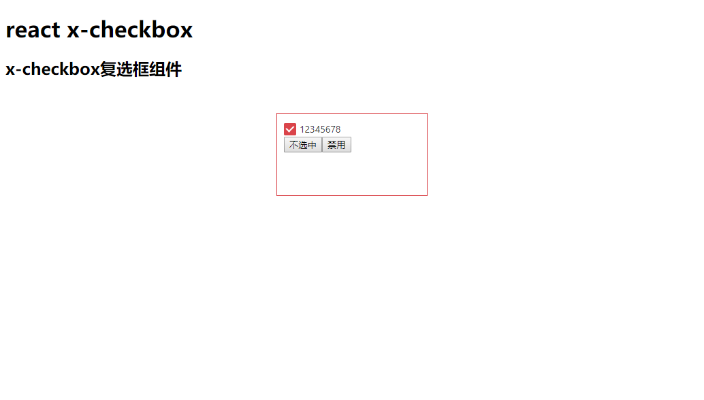

# x-checkbox
react复选框组件x-checkbox，它依赖于checkbox组件，主要是复选框封装.
# npm
    npm install --save x-checkbox
# 效果图

# 使用方式
```
  render() {
    return (
       <checkbox name = {checkboxName} value = {value} checked ={true/false} disabled = {true/false} onChange = {function(){}} text = "checkbox text">checkbox text </checkbox>
    )
  }
```

# API
## name
checkbox 的名称，name；
## value
checkbox 选中的值
## checked
checkbox 是否默认选中
## disabled
checkbox 是否禁用
## onChange
checkbox 改变触发的事件
## text
checkbox 显示的文本内容

### 关于作者
[https://github.com/luo-xzp](https://github.com/luo-xzp)

### 组件github地址
[https://github.com/react-xui/x-checkbox](https://github.com/react-xui/x-checkbox)

### xui
react xui组件一直在持续更新中，欢迎大家关注[https://github.com/react-xui](https://github.com/react-xui)